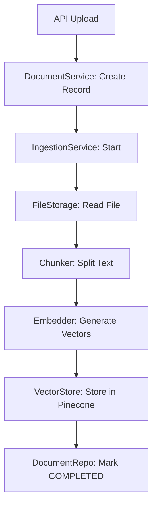
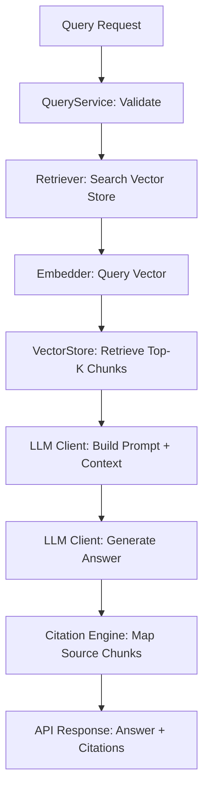

# LivingDocs Backend Architecture

Welcome to the **LivingDocs Backend** architecture guide. This document provides a comprehensive overview of the project's structure, design principles, and implementation details.

LivingDocs is a high-performance **FastAPI** backend designed for document management with advanced **RAG (Retrieval-Augmented Generation)** capabilities. It follows a strict **Clean Architecture** pattern to ensure maintainability, testability, and scalability.

---

##lean Architecture Principles

The project is organized into four distinct layers, each with a single responsibility and a strict dependency flow:

**Presentation (API) → Application → Domain ← Infrastructure**

### 1. Domain Layer (`app/domain/`)
The core of the system. It contains the business logic, entities, and business rules.
- **Pure Python**: Zero external dependencies (no FastAPI, no SQLAlchemy).
- **Entities**: Objects with identity and state machines (e.g., `Document`, `Chunk`).
- **Interfaces**: Abstract contracts that the Infrastructure layer must implement.
- **Rules**: Static validation logic (e.g., `DocumentRules`).

### 2. Application Layer (`app/application/`)
Orchestrates use cases by coordinating domain objects and infrastructure services.
- **Services**: Orchestrate workflows (e.g., `DocumentService`, `QueryService`).
- **DTOs**: Data Transfer Objects for communication between layers.
- **Decoupling**: Uses domain interfaces to remain independent of implementation details.

### 3. Infrastructure Layer (`app/infrastructure/`)
Contains concrete implementations for external I/O operations.
- **Database**: SQLAlchemy repositories and ORM models.
- **Storage**: File system or cloud storage (e.g., `LocalFileStore`).
- **RAG**: Chunker, Embedder, and Vector Store implementations.
- **Email/Security**: SMTP, JWT, and Hashing services.

### 4. Presentation Layer (`app/api/`)
The entry point for external requests via the web.
- **FastAPI Routes**: Thin handlers that call application services.
- **Dependency Injection**: Composition root using a DI `Container`.
- **Middleware**: Global error handling and security.

---

## 🧩 Module Breakdown

The system is modularized by "Aggregate Roots" to keep the codebase organized as it grows.

| Module | Purpose | Status |
| :--- | :--- | :--- |
| **Documents** | CRUD, versioning, and file storage for docs. | ✅ Complete |
| **RAG** | Vectorization, retrieval, and LLM generation. | ✅ Complete |
| **Users / Auth** | User management, JWT auth, and permissions. | ✅ Complete (Refactored) |
| **Projects** | Workspaces for grouping documents and chat. | ✅ Complete (Refactored) |
| **Chat** | Conversational history and session management. | ✅ Complete (Refactored) |

---

## 🚀 RAG Pipeline & Data Flow

### 1. Document Ingestion Pipeline
When a document is uploaded, it moves through a multi-stage ingestion pipeline:



### 2. RAG Query Pipeline
When a user asks a question, the system retrieves context and generates an answer:



---

## 🔌 Service Usage & API Reference

### Document Operations
To use the `DocumentService` in your routes:

```python
from app.api.container_dependencies import get_document_service

@router.post("/")
async def upload_doc(
    file: UploadFile,
    service: DocumentService = Depends(get_document_service)
):
    return await service.upload_document(file, project_id)
```

### RAG Query Operations
To use the `QueryService` for natural language questions:

```python
from app.api.container_dependencies import get_query_service

@router.post("/query")
async def ask_question(
    request: QueryRequestDTO,
    service: QueryService = Depends(get_query_service)
):
    return await service.query(request.question, request.project_id)
```

---

## 🛠️ Development Guide

### Adding a New Business Rule
1. Add a method to `app/domain/[module]/rules.py`.
2. Ensure it's a pure function and raises a `DomainException` if validation fails.
3. Call it from the corresponding Application Service.

### Adding a New External Service (e.g., S3 Storage)
1. Create a new implementation in `app/infrastructure/storage/s3_storage.py`.
2. Inherit from the `IFileStorage` interface defined in the domain layer.
3. Update `app/container.py` to inject the new implementation.

---

## 🧪 Testing Strategy

| Layer | Method | Goal |
| :--- | :--- | :--- |
| **Domain** | Unit Tests | Test business logic with zero mocks. |
| **Application** | Unit Tests | Test orchestration using mocked interfaces. |
| **Infrastructure** | Integration Tests | Test real database/API connections in isolation. |
| **Full System** | E2E Tests | Test complete flows (Upload → Ingest → Query). |

---

## 📂 Project Inventory (Core Structure)

```text
app/
├── api/                    # Thin FastAPI routes
├── application/            # Orchestration / Use Cases
├── config/                 # Unified settings & constants
├── domain/                 # Pure business logic (Entities, Interfaces)
├── infrastructure/         # External I/O (Database, RAG, Storage)
├── shared/                 # Common utilities
└── container.py            # Dependency Injection (Composition Root)
```

---

*Last Updated: March 6, 2026*
