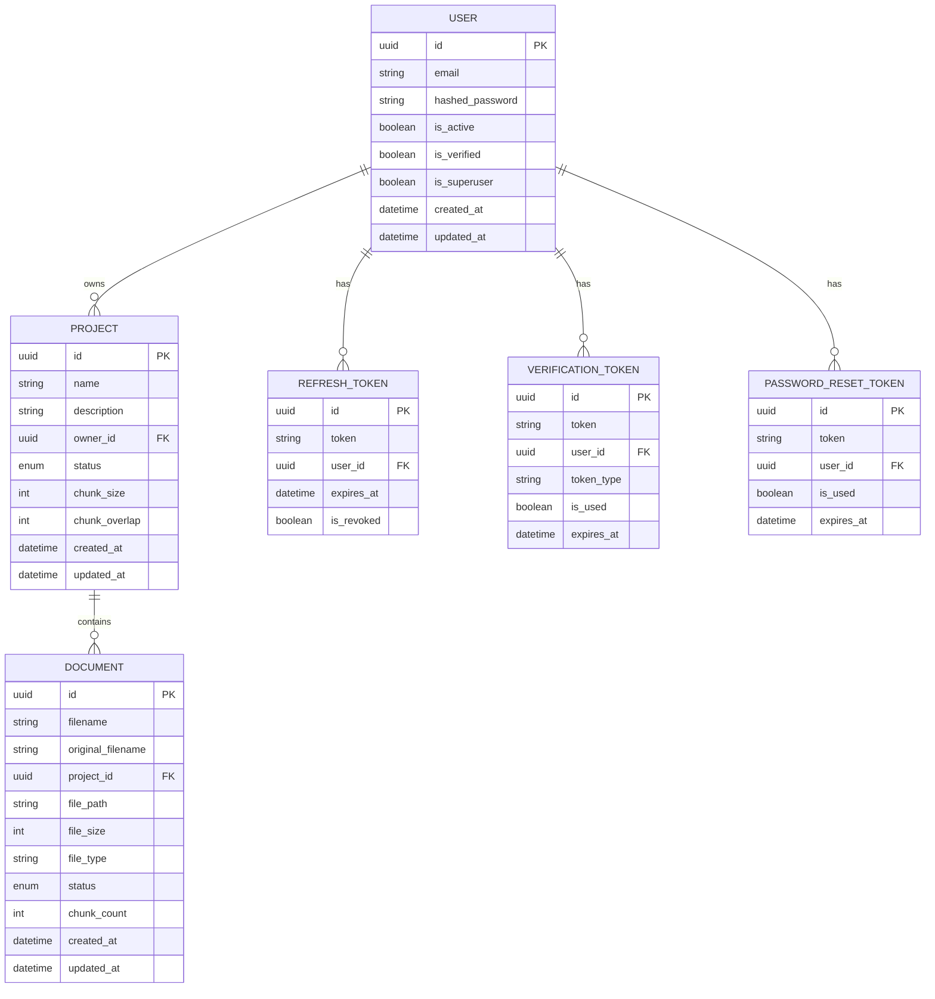

# Living Docs Backend

## Purpose
**Living Docs** is an AI-powered document intelligence system designed to provide RAG (Retrieval-Augmented Generation) capabilities. It allows users to upload various document formats (PDF, DOCX, PPTX, XLSX, MD, HTML), process them into searchable chunks, and query them using LLMs (Hugging Face) with precise character-level citations.

## Project Structure
The project follows a modular FastAPI structure:

- **alembic/**: Database migrations and versioning.
- **app/**: Main application logic.
    - **api/**: REST API endpoints and route handlers.
    - **db/**: Database configuration, models, and CRUD operations.
    - **rag/**: Core RAG pipeline implementation.
        - `chunker.py`: Document segmentation logic.
        - `embeddings.py`: Vector embedding generation (Hugging Face).
        - `retriever.py`: Document retrieval logic.
        - `vectorstore.py`: Pinecone integration.
        - `query.py`: RAG query orchestration.
    - **schemas/**: Pydantic models for request/response validation.
    - **services/**: Business logic (Authentication, Email, Document processing).
    - **storage/**: File handling and storage utilities.
    - **templates/**: Email and system templates.
    - **utils/**: Shared utility functions.
- **tests/**: Automated tests using `pytest`.
- **uploads/**: Local storage for uploaded documents.

## Project Model/Schema
The following diagram illustrates the core data models and their relationships:

### Entity Relationships
- **User**: The central entity. A user owns multiple projects and maintains various security tokens (Refresh, Verification, Password Reset).
- **Project**: A container for documentation related to a specific domain or use case. Each project belongs to exactly one user. It defines RAG configuration parameters like `chunk_size` and `chunk_overlap`.
- **Document**: Individual files uploaded to a project. Documents go through a lifecycle (Pending -> Processing -> Completed/Failed). They are associated with a single project and stripped of their content into vector embeddings during processing.
- **Tokens**: Auxiliary models for managing authentication state and security flows (email verification and password recovery).

## Endpoints

### Authentication (`/api/v1/auth`)
- `POST /register`: Register a new user.
- `POST /login`: Authenticate and receive access/refresh tokens.
- `POST /refresh`: Refresh access tokens.
- `POST /verify-email`: Verify user email.
- `POST /forgot-password`: Initiate password reset.
- `POST /reset-password`: Reset password using token.

### Users (`/api/v1/users`)
- `GET /me`: Get current user profile.
- `PATCH /me`: Update user profile.
- `DELETE /me`: Deactivate user account.

### Projects (`/api/v1/projects`)
- `GET /`: List user projects.
- `POST /`: Create a new project.
- `GET /{id}`: Get project details.
- `PATCH /{id}`: Update project.
- `DELETE /{id}`: Delete project.

### Documents (`/api/v1/documents`)
- `POST /upload`: Upload documents to a project.
- `GET /{id}`: Get document status and metadata.
- `DELETE /{id}`: Remove a document and its vector embeddings.
- `POST /{id}/process`: Manually trigger document ingestion/indexing.

### Query (`/api/v1/query`)
- `POST /`: Submit a natural language query against project documents.
- `GET /history`: Retrieve past query history.

### Health
- `GET /health`: System health status and dependency checks.

## Tech Stack
- **Framework**: FastAPI (Python 3.11+)
- **Database**: PostgreSQL with SQLAlchemy ORM
- **Migrations**: Alembic
- **Vector DB**: Pinecone
- **LLM/Embeddings**: Hugging Face
- **Orchestration**: LangChain
- **Testing**: Pytest

## Setup and Installation
1. Install dependencies: `pip install -r requirements.txt`
2. Configure environment variables in `.env`.
3. Run migrations: `alembic upgrade head`
4. Start the server: `uvicorn app.main:app --reload`
